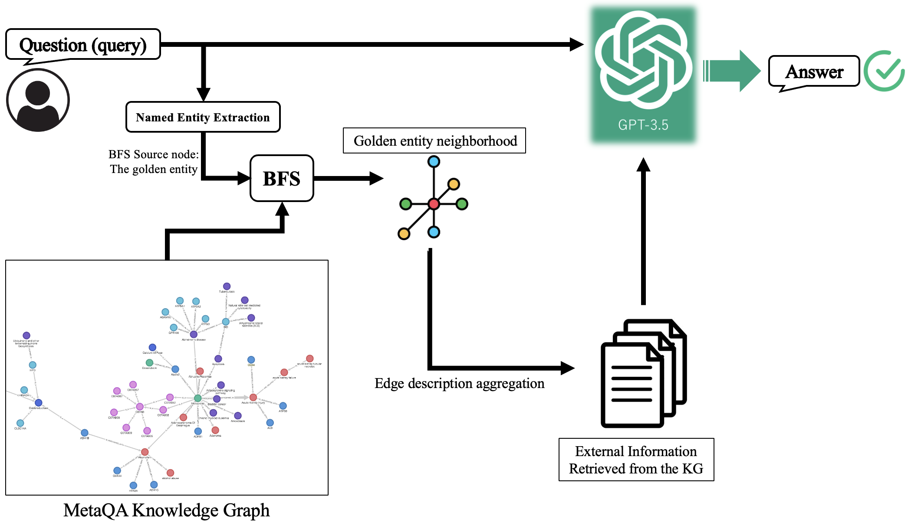

# Knowledge Graph-Based Question Answering System

This repository contains the implementation of a Question-Answering (QA) system that utilizes a knowledge graph to store information. The system processes queries through a large language model, asking it to answer the query based on the information retrieved from the knowledge graph. 

## Project Overview

The Knowledge Graph-Based QA system aims to answer questions by referring to a structured knowledge graph containing various entities and relations. The knowledge graph and the tests used present in the [MetaQA dataset](https://github.com/yuyuz/MetaQA) were used in this project. This system explores the use of large language models (LLMs) in conjunction with graph-based data to enhance the accuracy and relevance of the answers provided. The idea is to improve the baseline retrieval-augmented generation (RAG) technique by populating the LLM's context window with the most relevant information. 




## Features

- **Knowledge Graph Construction**: Utilizes NetworkX to build a multi-graph representing movies, actors, directors, genres, and more.
- **Query Processing**: Implements advanced techniques to identify and aggregate relevant graph regions in response to user queries.
- **Integration with LLMs**: Leverages language models to interpret and answer questions based on the graph data.

## Installation

Clone the repository and install the required packages:

```bash
git clone https://github.com/moeinsh78/KGQA-cs886.git
cd KGQA-cs886
